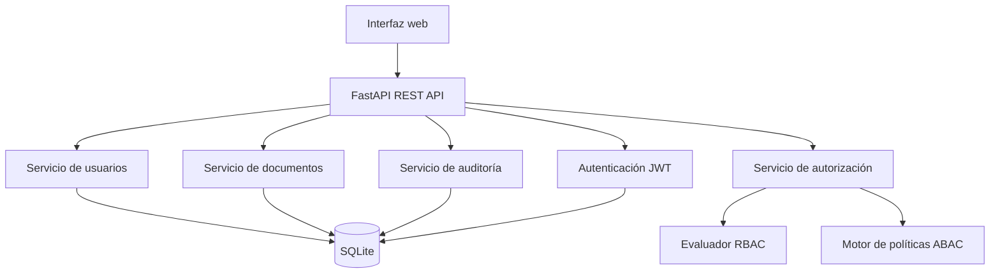
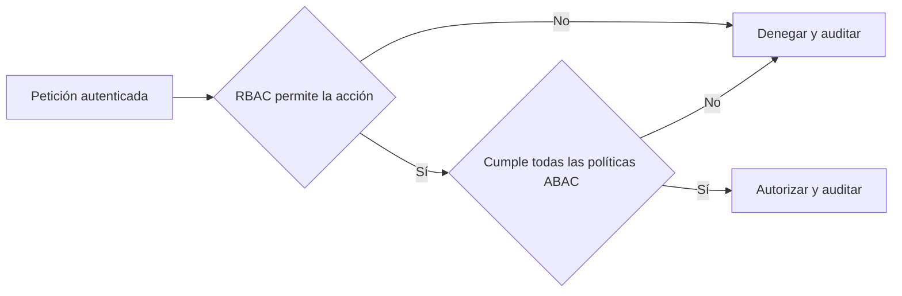

# SecureDocs

SecureDocs es una aplicación web para gestionar documentos empresariales con autorización en dos etapas. RBAC determina si el rol posee el permiso base y ABAC valida si la operación es aceptable según el usuario, el documento y el contexto de la solicitud.

La solución incluye autenticación JWT, cierre de sesión con revocación del token, administración de usuarios, ciclo de vida de documentos, motor de políticas centralizado, registro de cada decisión de acceso, interfaz web responsiva y una API REST documentada.

## Inicio rápido

### Requisitos

- Python 3.11 o superior
- Git

### Instalación local

```bash
git clone https://github.com/C5-PHO/DSN-Lab06.git
cd DSN-Lab06
python3 -m venv .venv
source .venv/bin/activate
python -m pip install -e '.[dev]'
cp .env.example .env
uvicorn app.main:app --reload --env-file .env
```

Abra `http://127.0.0.1:8000` para usar la interfaz o `http://127.0.0.1:8000/docs` para probar la API interactiva.

La base SQLite y los datos de demostración se crean automáticamente al iniciar la aplicación. En producción se debe establecer una clave JWT segura mediante `SECUREDOCS_SECRET_KEY`.

### Docker

```bash
docker compose up --build
```

La aplicación quedará disponible en `http://127.0.0.1:8000`.

## Usuarios de demostración

Todos utilizan la contraseña `Secure123!`.

| Rol | Correo | Departamento | Nivel |
|---|---|---:|---:|
| Administrador | `admin@securedocs.local` | TI | 5 |
| Gerente | `gerente@securedocs.local` | FINANZAS | 5 |
| Supervisor | `supervisor@securedocs.local` | FINANZAS | 4 |
| Empleado | `empleado@securedocs.local` | FINANZAS | 3 |
| Auditor | `auditor@securedocs.local` | AUDITORIA | 5 |
| Invitado | `invitado@securedocs.local` | PUBLICO | 1 |

## Arquitectura

La autenticación, RBAC y ABAC son componentes independientes. Las rutas nunca contienen reglas de rol dispersas: delegan la decisión al servicio de autorización y registran el resultado en auditoría.



El flujo de autorización es el siguiente:



Consulte [la descripción detallada de arquitectura](docs/architecture.md) para conocer las responsabilidades de cada componente y el modelo de datos.

## Matriz RBAC

| Operación | Administrador | Gerente | Supervisor | Empleado | Auditor | Invitado |
|---|:---:|:---:|:---:|:---:|:---:|:---:|
| Crear documento | Sí | Sí | Sí | Sí | No | No |
| Consultar documento | Sí | Sí | Sí | Sí | Sí | Sí |
| Modificar documento | Sí | Sí | Sí | Sí | No | No |
| Eliminar documento | Sí | Sí | No | No | No | No |
| Aprobar documento | Sí | Sí | Sí | No | No | No |
| Ver auditoría | Sí | Sí | No | No | Sí | No |
| Gestionar usuarios | Sí | No | No | No | No | No |
| Asignar roles | Sí | No | No | No | No | No |

Los permisos se cargan en las tablas `roles`, `permissions` y `role_permissions`. La matriz fuente se encuentra centralizada en `app/seed.py`.

## Matriz ABAC

| Política | Regla | Aplicación |
|---|---|---|
| Estado del usuario | `estado == ACTIVO` | Todas las operaciones |
| Departamento | Usuario y documento pertenecen al mismo departamento | Empleado, supervisor y gerente |
| Nivel de seguridad | `nivel_seguridad >= nivel_confidencialidad` | Operaciones sobre documentos |
| Propiedad | El usuario es propietario | Modificación, salvo gerente o administrador |
| Horario | 08:00 a 18:00 | Consulta de documentos nivel 4 o 5 |
| País | País del usuario y ubicación coinciden con el documento | Consulta de documentos |
| Dispositivo | Dispositivo corporativo | Consulta de documentos nivel 4 o 5 |
| Invitados | Externo, nivel 1 y documento publicado | Consulta de invitados |

Las políticas están implementadas como funciones independientes en `app/authorization/abac.py` y se ejecutan desde una única colección ordenada. Esto permite modificarlas sin tocar las rutas HTTP.

## Contexto de la solicitud

El laboratorio permite simular atributos del entorno con cabeceras HTTP:

- `X-Device`: `CORPORATIVO` o `PERSONAL`.
- `X-Location`: país desde el que se realiza el acceso.
- `X-Access-Time`: fecha y hora ISO 8601; está habilitada para demostración y pruebas.

En un entorno productivo, establezca `SECUREDOCS_ALLOW_CONTEXT_HEADERS=false` y obtenga estos atributos desde infraestructura confiable.

## API mínima

| Método | Ruta | Propósito |
|---|---|---|
| POST | `/auth/login` | Iniciar sesión y emitir JWT |
| POST | `/auth/logout` | Revocar el JWT actual |
| GET | `/usuarios` | Listar usuarios |
| POST | `/usuarios` | Registrar un usuario |
| PUT | `/usuarios/{id}` | Modificar usuario, estado o rol |
| GET | `/documentos` | Listar únicamente documentos autorizados |
| GET | `/documentos/{id}` | Consultar un documento |
| POST | `/documentos` | Crear un documento |
| PUT | `/documentos/{id}` | Modificar un documento |
| DELETE | `/documentos/{id}` | Eliminar un documento |
| POST | `/documentos/{id}/aprobar` | Aprobar y publicar un documento |
| GET | `/auditoria` | Consultar decisiones registradas |

## Auditoría

Cada intento evaluado registra usuario, recurso, acción, fecha, resultado, motivo, IP, ubicación y dispositivo. También se registran inicios de sesión permitidos o denegados y cierres de sesión.

```json
{
  "username": "empleado@securedocs.local",
  "resource": "DOCUMENTO",
  "resource_id": "1",
  "action": "APPROVE_DOCUMENT",
  "result": "DENEGADO",
  "reason": "El rol EMPLEADO no posee el permiso APPROVE_DOCUMENT",
  "location": "PERU",
  "device": "CORPORATIVO"
}
```

## Pruebas

```bash
source .venv/bin/activate
ruff check app tests
pytest --cov=app --cov-report=term-missing
```

La suite contiene los 12 casos obligatorios y 5 casos adicionales, además de pruebas integrales de autenticación, filtrado de documentos, aprobación, auditoría y revocación de token. La evidencia reproducible está en [docs/test-evidence.md](docs/test-evidence.md).

## Demostración

El guion de demostración está disponible en [docs/demo-script.md](docs/demo-script.md). Cubre un acceso permitido, una denegación RBAC, tres denegaciones ABAC, una aprobación y la trazabilidad en auditoría.

## Estructura principal

```text
app/
├── authorization/      Motor RBAC, políticas ABAC y servicio combinado
├── routers/            Autenticación, usuarios, documentos y auditoría
├── static/             Interfaz web
├── auditing.py         Registro uniforme de decisiones
├── models.py           Modelo relacional
├── security.py         Hash de contraseñas y JWT
└── seed.py             Roles, permisos, políticas y datos de demostración
docs/                   Arquitectura, evidencia y guion de demo
tests/                  Casos obligatorios, adicionales e integrales
```

## Decisiones de seguridad

- Las contraseñas se almacenan con bcrypt.
- Los JWT incluyen expiración e identificador único y pueden revocarse al cerrar sesión.
- RBAC se evalúa antes de ABAC y ninguna operación se autoriza si falla una etapa.
- Los listados de documentos filtran cada recurso con el mismo motor de autorización.
- Las modificaciones se validan contra el estado proyectado del documento para impedir elevar confidencialidad o cambiar departamento evadiendo ABAC.
- Los motivos de autorización o rechazo quedan trazables en la base de datos.
