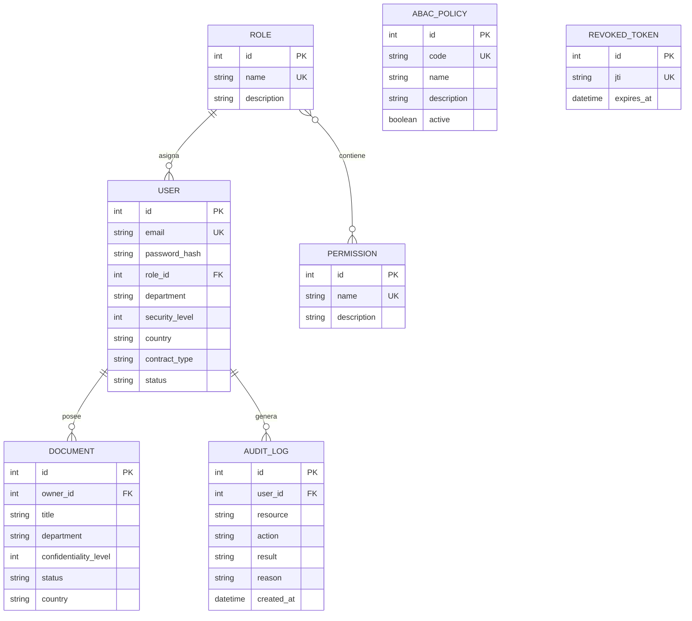

# Arquitectura y modelo de datos de SecureDocs

## Responsabilidades

| Componente | Responsabilidad |
|---|---|
| Interfaz web | Iniciar sesión, listar recursos autorizados, crear y aprobar documentos y consultar auditoría. |
| Routers REST | Validar solicitudes, resolver dependencias y delegar en los servicios. |
| Autenticación | Verificar credenciales, emitir JWT y comprobar tokens revocados. |
| RBAC | Confirmar que el rol contiene el permiso base para la acción. |
| ABAC | Ejecutar secuencialmente políticas de usuario, recurso y entorno. |
| Auditoría | Persistir decisiones permitidas y denegadas con su motivo. |
| Persistencia | Mantener usuarios, roles, permisos, documentos, políticas y auditoría. |

## Modelo relacional

El departamento se conserva como atributo normalizado en usuario y documento porque las políticas comparan su valor directamente. Puede migrarse a una entidad catálogo sin cambiar el contrato del motor ABAC.

## Secuencia de una operación protegida

1. La dependencia de autenticación valida firma, expiración y revocación del JWT.
2. La ruta carga el recurso solicitado.
3. El servicio de autorización verifica el permiso RBAC.
4. Si RBAC permite, el motor ejecuta las políticas ABAC en orden.
5. La decisión y su motivo se registran antes de responder.
6. La operación se ejecuta únicamente cuando ambas etapas permiten el acceso.

## Organización del motor de políticas

Cada política posee la firma uniforme `usuario + acción + documento + contexto`. Una política devuelve un motivo cuando rechaza la solicitud o `None` cuando no aplica o se cumple. La colección `POLICIES` centraliza el orden y evita condicionales de autorización distribuidos por los controladores.

## Límites de confianza

Las cabeceras de dispositivo, ubicación y hora existen para reproducir escenarios del laboratorio. En producción deben provenir de un proxy confiable, gestión de dispositivos o un proveedor de identidad.
